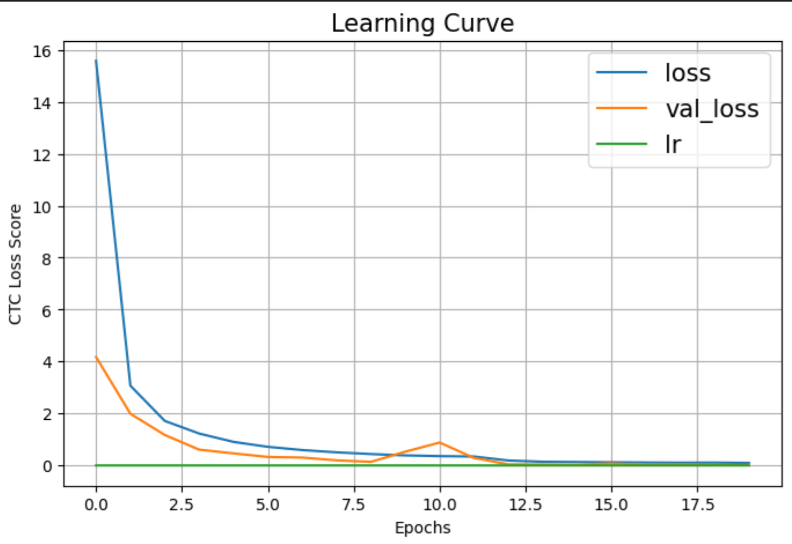

# **HumanAI**

## 🔍 Project Title

### **Automating Text Recognition and Transliteration of Historical Documents using Weighted Convolutional-Recurrent Architectures**

---

## 🧠 Project Description

Transliteration of centuries-old texts remains a challenge for modern OCR tools like Adobe Acrobat, which are optimized for clean, modern fonts. These tools often fail when confronted with archaic typefaces or manuscript-style writing.

This project addresses this gap by developing a hybrid end-to-end model leveraging **Convolutional Neural Networks (CNNs)** and **Recurrent Neural Networks (RNNs)** optimized with **CTC (Connectionist Temporal Classification)** loss. The model is tailored for recognizing and transliterating 17th-century Spanish printed texts, enabling high-accuracy OCR for historical works.

---

## 🧪 Task Name

### **RenAIssance Project Tests for Prospective GSoC 2025 Applicants**

---

## ✅ Task Overview

Over the past week, I developed a CNN-RNN-based architecture capable of performing accurate OCR on complex historical data. This builds upon my previous GSoC experience and integrates modern techniques and preprocessing workflows.

The solution is structured as a standalone notebook that can be run in Jupyter Notebook or Google Colab. All necessary code and model training pipelines are included for reproducibility and testing.

---

## 🧭 Approach and Methodology

1. **Literature Review**  
   Conducted extensive research on cutting-edge OCR methods to refine architecture design.

2. **Dataset Preparation**  
   Cleaned and structured the dataset to ensure consistency and improve training performance.

3. **PDF to Image Conversion**  
   Converted high-resolution scanned PDFs into image format for better model interpretation.

4. **Page Segmentation**  
   Split double-page scans into individual pages to enhance precision during model training.

5. **Text-Image Mapping**  
   Created a robust association mechanism between text labels and image regions for supervised learning.

6. **Word-Level Text Detection**  
   Used the model to accurately extract bounding boxes around words.

7. **Sorting and Clustering**  
   Applied a positional sorting technique to organize extracted elements vertically and then horizontally.

8. **Model Architecture**  
   Implemented a CNN-RNN hybrid with CTC loss, ensuring the model can predict sequences effectively without needing predefined alignments.

## 📉 Model Performance Visualization

- **CTC Loss Curve**  
  Shows a consistent decline indicating proper convergence during training.
  

- **Model Training Plot**  
  Illustrates performance improvements over training data.
  

- **Predicted OCR Output**  
   Samples of text predicted by the model that closely match ground truth values.
  

---

## 📊 Evaluation Metrics

| Metric                   | Value   |
| ------------------------ | ------- |
| **Character Error Rate** | 0.00195 |
| **Accuracy**             | 99.53%  |
| **CTC Training Loss**    | 0.0974  |
| **CTC Validation Loss**  | 0.0196  |

---

## 🔮 Future Roadmap

### 1. **Synthetic Data Augmentation**

To enhance generalization, I plan to generate synthetic examples resembling Renaissance-era fonts and scripts using generative models. This will help the model perform better on unseen historical formats.

### 2. **Model Fine-Tuning and Hyperparameter Optimization**

Further refining the architecture with:

- Regularization techniques
- Optimized learning rates and decay schedules
- Architecture tweaks (e.g., BiLSTM, Transformer-CNN hybrids)

These refinements will help achieve near-perfect results across varying historical sources.

---

## 📌 Conclusion

This project pushes the boundaries of traditional OCR systems by addressing the unique challenges posed by historical texts. The hybrid CNN-RNN approach demonstrates strong promise for future transliteration tools, empowering researchers and historians to access and preserve our shared cultural heritage more effectively.

---
